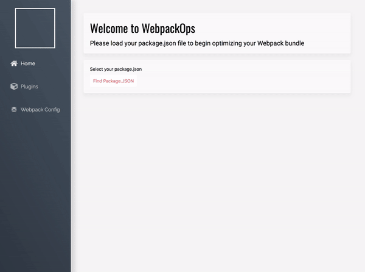

# WebpackOps


WebpackOps is a Webpack bundle optimization and visualization tool that helps developers lower the size of their Webpack bundle through customized plugin selection and Webpack.config generation. Webpack Ops also allows developers to visualize their bundle assets through interactive analysis charts. 



## Installation

**1.** Clone or Download the repository.
```
git clone https://github.com/CatSnake11/Webpack-Optimizer.git
```

**2.** Go to your terminal and run the following commands to download all required libraries:
```
npm install
npm run webpack
npm start
```

Download and install WebpackOps for Mac or Windows, and launch the application: http://www.webpackops.com.

## Usage
WebpackOps has 3 tabs - Home, Plugins, and Webpack Config. Below, please find instructions on how to use each tab:

**Home**
- Select your `package.json` file by clicking the "Find Package.JSON" button and selecting your `package.json` file.
- Select desired build configuration and click "Select Config" button.
- Click "Load Stats File" button and select the `stats.json` file that was generated in your local repository.
- Enjoy! You can now analyze your Webpack bundle in the four charts that are provided - Sunburst, Zoomable Sunburst, Treemap, and Zoomable Treemap.

**Plugins**
- Once you have loaded your `package.json` and `stats.json` files on the Home tab, select the plugins you would like to install in your Webpack bundle.
- Click the "Install" button to install plugins and display a visual representation of the reduction in your bundle size.

**Webpack Config**
- Generate a custom `webpack.config` file for your project. First, click the "Select" button to select your local repository where you would like to generate your `webpack.config` file.
- Select languages, libraries, frameworks you would like to add to your `webpack.config`. You can preview what your config will look like in the text window below. Once you have selected all desired features, click "Create Webpack Config File" to generate a new `webpack.config` file in your local repository.


## Task Database
Your To-Do application would be useless without a database to hold onto the tasks between sessions. To test your code, we will run it on a database we have created. This is why the `TaskModel` file looks a little odd. Please put the URI of the database you will be using (local or cloud hosted) in the `myURI` variable. Then uncomment out either the line mentioning MONGO_URI (if you're using MongoDB/Mongoose) **OR** the line mentioning PG_URI (if you're using PostgresQL/Sequelize). If your personal URI contains sensitive information (the password), feel free to replace `myURI` when you are ready to commit. We will not be testing your personal database, so we do not need to connect to it.

#### Task Model
In the `server/models/TaskModel.js` file, implement a database in either MongoDB or PostgresQL (Mongoose/Sequelize optional) as described below:
- [ ] We want to store our data in a collection/table called `Task`. (Remember, this may be created as the plural `Tasks` - that is fine.)
- [ ] All items in the database must have a property `item` which is a string
- [ ] Additionally, all items should be stored with the time they were `created_at`. This should default to the current time

#### Task controllers
In the `server/models/taskController.js` file, add the following functionality to the exported controller. (These will be server middleware/final handler functions, so they should take the appropriate parameters and perform the necessary callback operations.):
- [ ] Function `postTask` should create a new item in the database
- [ ] Function `getTasks` should retrieve all items from the database and send it back to the client as JSON
- [ ] Function `deleteTask` should find items in the database based on an ID number and delete that item if it exists


## Client-side JavaScript/DOM Manipulation
You are serving `index.js` to the client for use on the `secret` page, but there is not much existing functionality. Add code to achieve the following:

- [ ] When the button is clicked to get tasks, all tasks from the database should be displayed as list items in the `#task-list` element. These list items should display the task item followed by a `button` (inside the list item) with a class of `remove` and display an `X`. As an example, one list item might look like
`<li>Go shopping <button class="remove">X</button></li`
- [ ] Multiple clicks of the button to get tasks should not display the list items multiple times
- [ ] Clicking on the button to add a task should take the text from the input field and create a new task in the database. This task should be seen by clicking the button to get tasks after it has been added. (Optionally, you can display the new task immediately after adding.)
- [ ] Clicking on any list item's `X` button should remove the item from the list (immediately) and delete the task from the database


## Server Routing
By now, your server should serve the static assets, the login page, and the secret page. Add additional routes to achieve the following
functionality:
- [ ] If you have not already done so in conjunction with the tasks above, create the routes to tie the client-side JavaScript events to the appropriate database functions
- [ ] When the sign in form is submitted, it should redirect to the secret page route. This should **not** be done with AJAX. (This route will be authenticated in a later step.)


## Authentication
Modify your code to enforce the following authentication measures. (Use the `server/controllers/authController.js` file to add any middleware functions):
- [ ] The only successful login credentials should be to have a user of `codesmith` and a pass of `ilovetesting`. Providing these credentials will redirect to the secret page route as before. Any other credentials (or none at all) will send the string `unsuccessful login attempt`
- [ ] Providing the correct login credentials should set a cookie on the client with a key of `token` and a value of `admin`
- [ ] Visiting the `http://localhost:3333/secret` route directly should now check for the valid cookie before sending the secret page. If the cookie is not valid (or does not exist), send back the string `You must be signed in to view this page`
